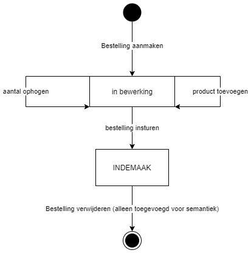
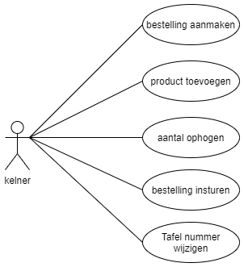

#Inleiding
Dit is het functioneel ontwerp van Are_Galaxy_Burger in dit document zal ik de documentatie delen betreft het Are_galaxy_burger project.

In dit document komen de volgende hoofdstukken aan bod
* Domain model
  * User Story hoofdstuk
  * Conclusie hoofstuk
* Hoofdstuk per klasse
  * Toestandsdiagram / lifeCycle
  * Use Cases
  * Sitemap & wireframes
* Cumulatieve sitemap & wireframes

#Domain Model
In dit hoofdstuk wordt een analyse gemaakt van de userstories om zote komen tot een volledig domein model

##User Story hoofdstuk
In dit subhoofdstuk maken we een analyse per userstory en geven de benodigde domeinklassen daarbij aan. 
___
### #1 UserStory: kelner bestelling invoeren
Userstory: ALS Kelner WIL IK een bestelling kunnen invoeren ZODAT de barman of kok dit later kan uitlezen om de bestelling te bereiden.
Voor deze userstory heb ik het volgende domein analyse gemaakt.

####Bestellingen
Een bestelling is aangemaakt om de kelner de mogelijkheid te geven een bestelling te kunnen voeren. 

Een bestelling heeft de volgende attributen

* Tafelnummer
  * Wordt gebruikt om de bestelling aan een tafel in het restaurant te verbindern
* Bestelstatus
  * Wordt gebruikt om een status van een bestelling bij te houden en is begrenst met een enum

Een bestelling heeft de volgende methoden.
* Bestelling aanmaken()
  * Hiermee kan de bestelling met een specifiek tafelnummer aangemaakt worden.
* productToevoegen()
  * Hiermee wordt een product toegevoegd als bestelregel aan de bestelling.
* aantalOphogen()
  * Hiermee wordt het aantal van een product in een bestelRegel verhoogd.
* BestellingInsturen()
  * Hiermee wordt de status gewijzigd van in_bewerking naar wordt_bereid

####BestelRegels
Bestelregels staat in het model omdat een bestelling uit meerdere bestelde producten bestaan.
deze staan over het algemeen onder elkaar geschreven met een aantal erachter.
Ik heb in dit model ervoor gekozen om dit bestelregels te noemen omdat ik dit wel een logische naam vind.

Een bestelregel hoort bij een bestelling en komt 0 of meer keren terug in een bestelling.

Een bestelregel heeft de volgende attributen
* Productnaam 
  * De productnaam is niet begrenst met een enum omdat de data hiervoor uiteindelijk uit de database zou komen
* Het product type
  * Het product type is begrenst doormiddel van een enum omdat dit een vrij vaststaand gegeven is
* Aantal
  * Het aantal wordt gebruikt zodat je niet 2 regels met het zelfde product hoeft in te voeren

Een Bestelregel heeft de volgende methoden
* AantalOphogen()
  * Met deze methode wordt het aantal van de bestelregel opgehoogd

___
##Conclusie hoofdstuk
Nu per userstory een diagram is gemaakt heb ik deze samengevoegd tot een volledig diagram zoals hieronder vermeld

Een bestelling heeft de volgende attributen

* Tafelnummer
  * Wordt gebruikt om de bestelling aan een tafel in het restaurant te verbindern
* Bestelstatus
  * Wordt gebruikt om een status van een bestelling bij te houden en is begrenst met een enum

Een bestelling heeft de volgende methoden.
* Bestelling aanmaken()
  * Hiermee kan de bestelling met een specifiek tafelnummer aangemaakt worden.
* productToevoegen()
  * Hiermee wordt een product toegevoegd als bestelregel aan de bestelling.
* aantalOphogen()
  * Hiermee wordt het aantal van een product in een bestelRegel verhoogd.
* BestellingInsturen()
  * Hiermee wordt de status gewijzigd van in_bewerking naar wordt_bereid

####BestelRegels
Bestelregels staat in het model omdat een bestelling uit meerdere bestelde producten bestaan.
deze staan over het algemeen onder elkaar geschreven met een aantal erachter.
Ik heb in dit model ervoor gekozen om dit bestelregels te noemen omdat ik dit wel een logische naam vind.

Een bestelregel hoort bij een bestelling en komt 0 of meer keren terug in een bestelling.

Een bestelregel heeft de volgende attributen
* Productnaam
  * De productnaam is niet begrenst met een enum omdat de data hiervoor uiteindelijk uit de database zou komen
* Het product type
  * Het product type is begrenst doormiddel van een enum omdat dit een vrij vaststaand gegeven is
* Aantal
  * Het aantal wordt gebruikt zodat je niet 2 regels met het zelfde product hoeft in te voeren

Een Bestelregel heeft de volgende methoden
* AantalOphogen()
  * Met deze methode wordt het aantal van de bestelregel opgehoogd

___
#Hoofdstuk per klasse
In dit hoofstuk worden de lifecycles wireframes en usecase diagrammen besproken per domeinklasse

##Bestellingen
###Toestandsdiagram / Lifecycle

###Use Cases

###Sitemap & Wireframes

___
##BestelRegels
###Toestandsdiagram / Lifecycle

###Use Cases

###Sitemap & Wireframes
___
#Cumulatieve Sitemap & Wireframes