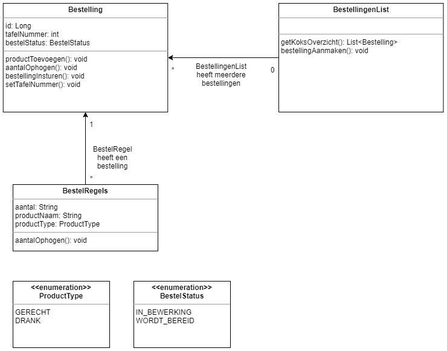
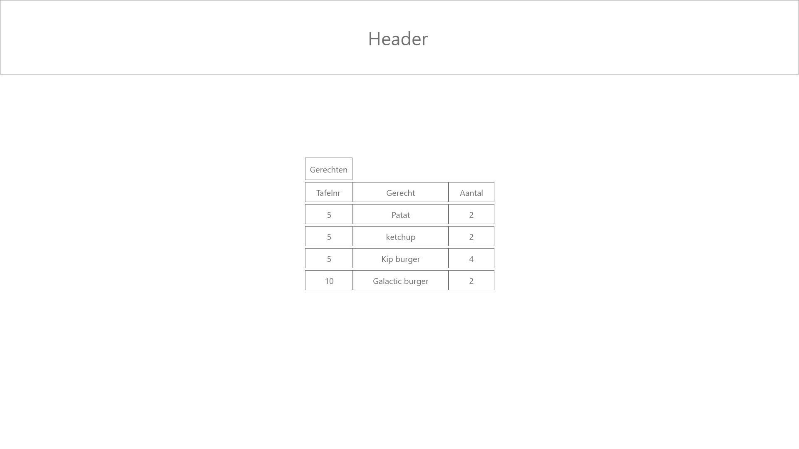

# Inleiding
Dit is het functioneel ontwerp van Are_Galaxy_Burger in dit document zal ik de documentatie delen betreft het Are_galaxy_burger project.

In dit document komen de volgende hoofdstukken aan bod
* [Domain model](#domain-model)
  * [Analyse per userstory](#user-story-hoofdstuk)
    * [#1 UserStory: kelner bestelling invoeren](#userstory1)
    * [#2 UserStory: kok bestellingen overzicht](#userstory2)
  * [Conclusie](#conclusie-hoofdstuk)
* [Uitwerking per domeinklasse](#hoofdstuk-per-klasse)
  * [BestellingenList](#bestellingen-list)
  * [Bestelling](#bestelling)
  * [Bestelregels](#bestelregels)
* [Cumulatieve sitemap & wireframes](#Cumulatieve-sitemap-&-wireframes)
  * [Sitemap](#sitemap)

# Domain Model
In dit hoofdstuk wordt een analyse gemaakt van de userstories om zo tot een volledig domein model te komen

## Analyse per userstory
In dit subhoofdstuk maken we een analyse per userstory en geven de benodigde domeinklassen daarbij aan. 
___
###  #1 UserStory: kelner bestelling invoeren
Userstory: ALS Kelner WIL IK een bestelling kunnen invoeren ZODAT de barman of kok dit later kan uitlezen om de bestelling te bereiden.
Voor deze userstory heb ik het volgende domein analyse gemaakt.

#### Bestelling
Een bestelling is aangemaakt om de kelner de mogelijkheid te geven een bestelling te kunnen voeren. 

Een bestelling heeft de volgende attributen

* id
  * wordt gebruikt om een bestelling uniek te identificeren
* tafelNummer
  * Wordt gebruikt om de bestelling aan een tafel in het restaurant te verbindern
* bestelStatus
  * Wordt gebruikt om een status van een bestelling bij te houden en is begrenst met een enum

Een bestelling heeft de volgende methoden.
* productToevoegen()
  * Hiermee wordt een product toegevoegd als bestelregel aan de bestelling.
* aantalOphogen()
  * Hiermee wordt het aantal van een product in een bestelRegel verhoogd.
* BestellingInsturen()
  * Hiermee wordt de status gewijzigd van in_bewerking naar wordt_bereid
* setTafelNummer
  * Hiermee kan het tafelNummer van een bestelling gewijzigd worden

#### BestelRegels
Bestelregels staat in het model omdat een bestelling uit meerdere bestelde producten bestaan.
deze staan over het algemeen onder elkaar geschreven met een aantal erachter.
Ik heb in dit model ervoor gekozen om dit bestelregels te noemen omdat ik dit wel een logische naam vind.

Een bestelregel hoort bij een bestelling en komt 0 of meer keren terug in een bestelling.

Een bestelregel heeft de volgende attributen
* Productnaam 
  * De productnaam is niet begrenst met een enum omdat de data hiervoor uiteindelijk uit de database zou komen
* Het product type
  * Het product type is begrenst doormiddel van een enum omdat dit een vrij vaststaand gegeven is
* Aantal
  * Het aantal wordt gebruikt zodat je niet 2 regels met het zelfde product hoeft in te voeren

Een Bestelregel heeft de volgende methoden
* AantalOphogen()
  * Met deze methode wordt het aantal van de bestelregel opgehoogd

___
###  #2 UserStory: kok bestellingen overzicht
Userstory: ALS kok WIL IK de ingevoerde bestellingen kunnen uitlezen ZODAT ik weet welke gerechten ik moet maken.

#### BestellingenList
Een bestellingenList heeft toegang tot alle bestellingen en via daar tot de bestelRegels.
Dit is nodig omdat zo een lijst gemaakt kan worden van de benodigde bestellingen

een bestellingenList heeft de volgende methoden
- getKoksOverzicht()
  - deze methode geeft alle gerechten terug die gemaakt moeten worden gebaseerd op de volgende zaken
    - Er staan alleen producten in met ProductType GERECHT
    - De lijst is gesorteerd op het id van een bestelling
    - Er komen alleen producten in voor met de bestelStatus WORDT_BEREID

#### Bestelling
Een bestelling is aangemaakt om dat deze de data voor de kok bijhoud voor elke bestelling.

Een bestelling heeft de volgende attributen

* id
  * wordt gebruikt om een bestelling uniek te identificeren
* tafelNummer
  * Wordt gebruikt om de bestelling aan een tafel in het restaurant te verbindern
* bestelStatus
  * Wordt gebruikt om een status van een bestelling bij te houden en is begrenst met een enum
  

#### BestelRegels
Bestelregels staat in het model omdat een bestelling uit meerdere bestelde producten bestaan.
deze staan over het algemeen onder elkaar geschreven met een aantal erachter.
Ik heb in dit model ervoor gekozen om dit bestelregels te noemen omdat ik dit wel een logische naam vind.

Een bestelregel hoort bij een bestelling en komt 0 of meer keren terug in een bestelling.

Een bestelregel heeft de volgende attributen
* Productnaam
  * De productnaam is niet begrenst met een enum omdat de data hiervoor uiteindelijk uit de database zou komen
* Het product type
  * Het product type is begrenst doormiddel van een enum omdat dit een vrij vaststaand gegeven is
* Aantal
  * Het aantal wordt gebruikt zodat je niet 2 regels met het zelfde product hoeft in te voeren

___
## Conclusie
Nu per userstory een diagram is gemaakt heb ik deze samengevoegd tot een volledig diagram zoals hieronder vermeld

#### BestellingenList
Een bestellingenList heeft toegang tot alle bestellingen en via daar tot de bestelRegels.
Dit is nodig omdat zo een lijst gemaakt kan worden van de benodigde bestellingen

een bestellingenList heeft de volgende methoden
- getKoksOverzicht()
  - deze methode geeft alle gerechten terug die gemaakt moeten worden gebaseerd op de volgende zaken
    - Er staan alleen producten in met ProductType GERECHT
    - De lijst is gesorteerd op het id van een bestelling
    - Er komen alleen producten in voor met de bestelStatus WORDT_BEREID
- bestellingAanmaken()
  - In deze functie wordt een nieuwe bestelling aangemaakt en toegevoegt aan de Lijst

#### Bestelling
Een bestelling is aangemaakt om de kelner de mogelijkheid te geven een bestelling te kunnen voeren.
Ook heeft de kok hem nodig omdat dit de data drager is voor elke bestelling

Een bestelling heeft de volgende attributen

* id
  * wordt gebruikt om een bestelling uniek te identificeren
* tafelNummer
  * Wordt gebruikt om de bestelling aan een tafel in het restaurant te verbindern
* bestelStatus
  * Wordt gebruikt om een status van een bestelling bij te houden en is begrenst met een enum

Een bestelling heeft de volgende methoden.
* productToevoegen()
  * Hiermee wordt een product toegevoegd als bestelregel aan de bestelling.
* aantalOphogen()
  * Hiermee wordt het aantal van een product in een bestelRegel verhoogd.
* bestellingInsturen()
  * Hiermee wordt de status gewijzigd van in_bewerking naar wordt_bereid
* setTafelNummer
  * Hiermee kan het tafelNummer van een bestelling gewijzigd worden

#### BestelRegels
Bestelregels staat in het model omdat een bestelling uit meerdere bestelde producten bestaan.
deze staan over het algemeen onder elkaar geschreven met een aantal erachter.
Ik heb in dit model ervoor gekozen om dit bestelregels te noemen omdat ik dit wel een logische naam vind.

Een bestelregel hoort bij een bestelling en komt 0 of meer keren terug in een bestelling.

Een bestelregel heeft de volgende attributen
* Productnaam
  * De productnaam is niet begrenst met een enum omdat de data hiervoor uiteindelijk uit de database zou komen
* Het product type
  * Het product type is begrenst doormiddel van een enum omdat dit een vrij vaststaand gegeven is
* Aantal
  * Het aantal wordt gebruikt zodat je niet 2 regels met het zelfde product hoeft in te voeren

Een Bestelregel heeft de volgende methoden
* AantalOphogen()
  * Met deze methode wordt het aantal van de bestelregel opgehoogd

___
#  Uitwerking per domeinklasse

In dit hoofstuk worden de lifecycles, wireframes en usecase diagrammen besproken per domeinklasse

---
##  BestellingenList

### Toestandsdiagram / Lifecycle

In bovenstaand diagram zie je de lifeCycle van een bestellingenlist deze heeft de volgende interacties per status
  - bestellingen list bestaat
    - get koksoverzicht
      - dit verandert niets en is alleen een lees actie.

### Use Cases

In bovenstaand usecase diagram zie je de volgende usecases per actor
- kok
  - bestelling aanmaken

### Sitemap & Wireframes

#### koksoverzicht

In het hierboven gemaakte wireframe zie je de volgende elementen
- Een placeholder voor de header
- een blok met de tekst gerechten om aan te duiden dat het alleen gerechten bevat
- een rij met de volgende kolomNamen
  - tafelNr
  - gerecht
  - aantal
- Een tabel van 4 rijen met verschillende bestelde gerechten

---
##  Bestelling
### Toestandsdiagram / Lifecycle

In dit diagram staat de lifecycle bijbehorende bij een bestelling.
In deze lifecycle heb je 2 states namelijk de volgende.
  - in bewerking
    - Een bestelling komt in deze toestand als hij wordt aangemaakt.
    - in deze staat kan een bestelling aangepast worden door een product toe tevoegen. Ook kan 
    het aantal opgehoogd worden van elk product, Als laatst kan het tafelnummer gewijzigd worden.
  - in de maak
    - Een bestelling komt in deze toestand als een bestelling die in bewerking is wordt ingestuurd 
    - deze status is het aanmaken afgerond en diend de bestelling alleen nog om uitgelezen te worden.

  Aanvullend hierop kan een bestelling ook aangemaakt worden. 

### Use Cases

In bovenstaand usecase diagram zie je de volgende usecases per actor
- kelner
  - bestelling aanmaken
  - product toevoegen
  - aantal ophogen
  - bestelling insturen
  - tafel nummer wijzigen

### Sitemap & Wireframes

#### bestelling invoeren

In het hierboven gemaakte wireframe zie je de volgende elementen
- Een placeholder voor de header
- een blok met de text tafelNr met daarnaast een invoer veld voor het tafelnummer
- een tabel met de volgende elementen.
  - een bovenste rij met kolomnamen.
  - 2 rijen om de data van een bestelregel vast te houden.
- een vak met een + om een rij aan de tabel toe te voegen.
- een knop om de bestelling in te sturen met de naam "Bestelling insturen"

___
##  Bestelregels
### Toestandsdiagram / Lifecycle

### Use Cases

in de hierboven gemaakte usecase diagram zie je de volgende actie per actor
- kelner
  - aantal ophogen

### Sitemap & Wireframes

#### bestelling invoeren

In het hierboven gemaakte wireframe zie je de volgende elementen
- Een placeholder voor de header
- een blok met de text tafelNr met daarnaast een invoer veld voor het tafelnummer
- een tabel met de volgende elementen.
  - een bovenste rij met kolomnamen.
  - 2 rijen om de data van een bestelregel vast te houden.
- een vak met een + om een rij aan de tabel toe te voegen.
- een knop om de bestelling in te sturen met de naam "Bestelling insturen"
___
#  Cumulatieve sitemap & wireframes

#### Bestelling invoeren

In het hierboven gemaakte wireframe zie je de volgende elementen
- Een placeholder voor de header
- een blok met de text tafelNr met daarnaast een invoer veld voor het tafelnummer
- een tabel met de volgende elementen.
  - een bovenste rij met kolomnamen.
  - 2 rijen om de data van een bestelregel vast te houden.
- een vak met een + om een rij aan de tabel toe te voegen.
- een knop om de bestelling in te sturen met de naam "Bestelling insturen"

#### koksoverzicht

In het hierboven gemaakte wireframe zie je de volgende elementen
- Een placeholder voor de header
- een blok met de tekst gerechten om aan te duiden dat het alleen gerechten bevat
- een rij met de volgende kolomNamen
  - tafelNr
  - gerecht
  - aantal
- Een tabel van 4 rijen met verschillende bestelde gerechten

#### Header

Hierboven zie je de wireframe van de header zoals die gebruikt wordt boven elke pagina
In de header staat de volgende knoppen
- Home
  - deze knop is een link welke leid naar de homepage
- Koksoverzicht
  - deze knop leid naar het koksoverzicht

#### Home

Hierboven zie je de wireframe van de homepage deze bevat de volgende zaken
- Een placeholder voor de header.
- Een knop om naar de bestelling invoeren pagina te gaan.
- Een knop om naar het koksoverzicht te gaan.

##  Sitemap

Hierboven zie je de sitemap van de applicatie deze heeft de volgende pagina's en navigatie mogelijkheden:
- Een header met de navigatie mogelijkheden
  - een knop home welke leid naar de homepagina
  - een knop koksoverzicht welke leid naar het koksoverzicht 
- Home met de volgende navigatie mogelijkheden
  - een knop om een nieuwe bestelling in te voeren
  - een knop naar het koksoverzicht
- Koksoverzicht
- Bestelling invoeren

In de sitemap staan rode texten in elke wireframe deze geven aan om welk element / pagina het gaat. Ook zijn er rode pijlen welke aangeven waar een navigatie element naar toe verwijst. 

De header is geen aparte pagina. Deze komt op de plaats te staan waar nu een header placeholder staat zoals gebruikt op een aantal wireframes.

